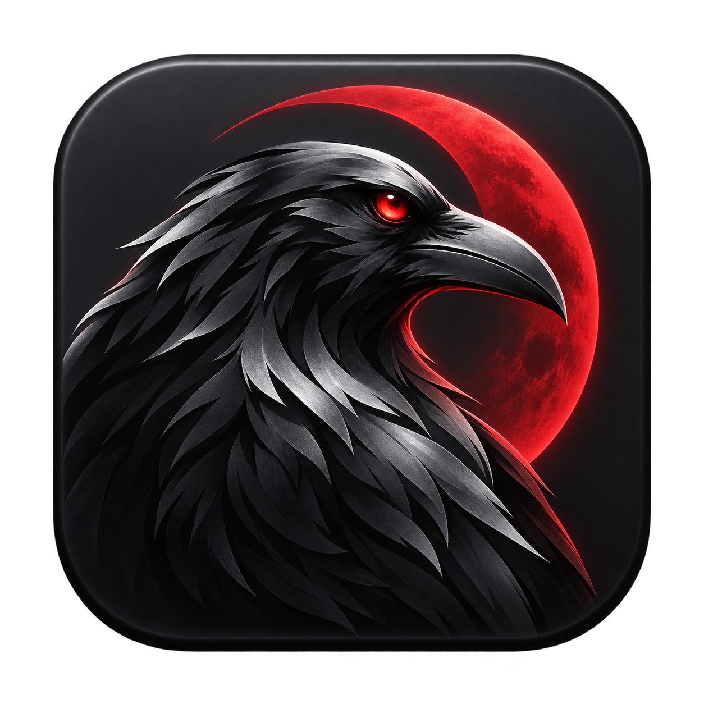

# 死神 VS 火影 · Mac 版

让旧版《死神 VS 火影》在 Mac 上运行。保留原来的角色、招式和地图，打包后双击就能玩，存档自动保存。

## 开始使用

本仓库提供适配工具，**不含游戏本体或可直接下载的安装包**。你需要自备对应的旧版游戏文件，再按 [构建说明](docs/build.md) 制作 Mac 应用。

已在 M3 Mac（macOS 15.6.1）上实际试玩。其他环境尚未验证。

---

感谢原作者剑 jian 与 [5DPLAY Game Studio](https://github.com/5DPLAY-Game-Studio/BleachVsNaruto)。这是非官方适配项目。

[反馈问题](https://github.com/mizhidaili/bvn-macos/issues) · [代码许可](LICENSE) · [素材说明](THIRD_PARTY_NOTICES.md)
